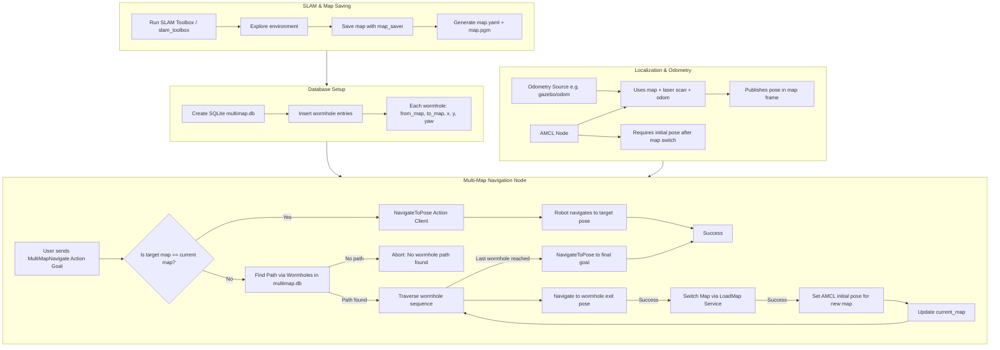

# Multi-Map-Navigation

This project extends Nav2 with the ability to navigate across multiple maps, using a custom action and a wormhole database. Compatible with ROS 2 Humble.

## Package Overview
### Anscer Navigation
This package contains codes to run the Nav2 System and the Multi-Map System. Multi-Map system uses BFS to find paths between maps that are not directly connected through a wormhole.

#### Purpose

- Navigate to goals that may exist in different maps.
- Handle map switching dynamically.
- Access wormhole connections between maps.
- Provide a custom action server (multi_map_navigate).

#### Action
```
# Goal
string target_map
float64 x
float64 y
float64 yaw
---
# Result
bool success
string message
---
# Feedback
string current_map
```

---

### Anscer Slam
This package contains codes to run SLAM (slam_toolbox) and the Map Saver node which saves the map as well as wormhole coordinates straight into SQL DB through an exposed service.

#### Purpose
- Perform Mapping
- Automate storage of map details into a SQL DB

#### Service
```
# Request
string map_from
string map_to
string map_name
---
# Response
bool success
string message
```

---

### Database (SQLITE)
Location: maps/multimap.db

#### Schema
```
CREATE TABLE wormhole (
  map_from TEXT,
  map_to   TEXT,
  x        REAL,
  y        REAL,
  yaw      REAL
);
```

#### Meaning
Each row defines a wormhole:
- map_from: Source map name
- map_to: Target map name
- (x, y, yaw): Pose of wormhole in the source map
Each connection is bidirectional, so two entries are inserted.

---

### Anscer Description
This package contains necessary URDF and Xacro files for simulation.

---

### Anscer Teleop
This package contains custom WASD / Arrow key Teleop node.

---

### Simulation PKG
This package contains launch files to run the simulation.

---

## Steps to run

### Database
```
sudo apt update
sudo apt install sqlite3
```

### Build
```
rosdep install --from-paths src --ignore-src -r -y
colcon build --symlink-install
```
Note: Source every terminal hence forth
### Run Simulation (Terminal 1)
```
ros2 launch simulation_pkg sim.launch.py
```

### Run SLAM (Terminal 2) (Optional only if you want to make your own maps)
```
ros2 launch anscer_slam slam_launcher.launch.py
```

### Run Wormhole Saver Service (Terminal 3) (Optional)
```
ros2 run anscer_slam wormhole_saver_service
```

Sample Call:

``` ros2 service call /save_wormhole anscer_slam/srv/SaveWormhole "{map_from: 'Hallway', map_to: 'Room1', map_name: 'Hallway_map'}" ```

### Run Teleop (Terminal 4) (Optional)
```
ros2 run anscer_teleop teleop_node
```

### Run Nav2 (Terminal 4) (only if teleop is not used)
```
ros2 launch anscer_navigation anscer_bringup.launch.py
```

### Run Map Manager (Terminal 5)
```
ros2 run anscer_navigation multi_map_node
```

Sample Goal:

```ros2 action send_goal /multi_map_navigate anscer_navigation/action/MultiMapNavigate "{target_map: 'Room1', x: 0.0, y: 0.0, yaw: 0.0}" ```


---

## Program Flow



---
## Known Issues

- Once Map Switches, Re-initialization of Map doesn't take place if you have created the new Room map in the same SLAM Session without resetting Odometry.
- Certain File Paths are Hardcoded.
- Launch File Creation Left to make it easier to use.